# 🎯 N8N Workflow No-Shows V2 - ARQUITECTURA CORRECTA

**Fecha**: 2025-11-23  
**Estado**: ✅ Listo para implementación  
**Nivel**: Producción - Enterprise Grade

---

## 📋 ÍNDICE

1. [Cambios Críticos vs V1](#cambios-críticos-vs-v1)
2. [Arquitectura de Responsabilidades](#arquitectura-de-responsabilidades)
3. [Workflow 1: Recordatorio 24h](#workflow-1-recordatorio-24h)
4. [Workflow 2: Recordatorio 4h](#workflow-2-recordatorio-4h)
5. [Workflow 3: Alertas 2h (NO Auto-cancelación)](#workflow-3-alertas-2h-no-auto-cancelación)
6. [Webhook: Procesar Respuestas WhatsApp](#webhook-procesar-respuestas-whatsapp)
7. [Testing y Validación](#testing-y-validación)

---

## 🚨 CAMBIOS CRÍTICOS VS V1

### ❌ LO QUE ESTABA MAL (V1)

```javascript
// ❌ N8N manipulaba directamente availability_slots
UPDATE availability_slots SET is_available = true WHERE ...;

// ❌ N8N auto-cancelaba sin criterio
UPDATE appointments SET status = 'no_show' WHERE ...;

// ❌ No había registro de confirmaciones
// (Mensaje enviado → al vacío)

// ❌ No había risk scoring
// (Todos los clientes tratados igual)
```

### ✅ LO QUE ESTÁ BIEN (V2)

```javascript
// ✅ LA BASE DE DATOS libera slots automáticamente (trigger)
-- Trigger: auto_release_slots_on_status_change()
-- Se ejecuta cuando status → 'no_show' o 'cancelled'

// ✅ N8N solo REGISTRA confirmaciones
SELECT record_customer_confirmation(
  appointment_id, '24h', 'whatsapp', 'Mensaje...', 5, 'twilio'
);

// ✅ N8N calcula risk_score antes de decidir
SELECT * FROM calculate_smart_risk_score(customer_id);
-- Solo auto-cancela si risk_level = 'CRITICAL'

// ✅ N8N NUNCA manipula slots directamente
-- La BD garantiza consistencia atómica
```

---

## 🏗️ ARQUITECTURA DE RESPONSABILIDADES

| Componente | Responsabilidad | Ejemplo |
|------------|----------------|---------|
| **PostgreSQL (triggers)** | Liberar slots automáticamente | `auto_release_slots_on_status_change()` |
| **PostgreSQL (functions)** | Calcular risk scores, registrar confirmaciones | `calculate_smart_risk_score()`, `record_customer_confirmation()` |
| **N8N** | Enviar mensajes, leer respuestas, llamar funciones | `POST /whatsapp/send`, `SELECT record_customer_confirmation()` |
| **LA-IA (frontend)** | Mostrar alertas, permitir intervención manual | Modal "Alto Riesgo" si `risk_level = HIGH` |

---

## 📅 WORKFLOW 1: Recordatorio 24h

**Objetivo**: Enviar confirmación inicial 24 horas antes del appointment.

### Configuración

- **Trigger**: Cron (cada 15 minutos)
- **Ventana**: Appointments en las próximas 23h 45min - 24h 15min
- **Canal**: WhatsApp
- **Coste**: ~5 céntimos/mensaje

### Nodos N8N



```mermaid
graph LR
    A[Cron: Cada 15min] --> B[Supabase: SELECT appointments]
    B --> C{¿Appointments en 24h?}
    C -->|No| Z[Fin]
    C -->|Sí| D[Calcular risk_score]
    D --> E[WhatsApp: Enviar confirmación]
    E --> F[DB: Registrar confirmación]
    F --> Z
```

### 1. Nodo: SELECT appointments próximos

**Tipo**: Supabase  
**Operación**: Execute SQL

```sql
SELECT 
    a.id AS appointment_id,
    a.customer_id,
    c.name AS customer_name,
    c.phone AS customer_phone,
    a.appointment_date,
    a.appointment_time,
    s.name AS service_name,
    s.duration_minutes,
    a.business_id
FROM appointments a
JOIN customers c ON a.customer_id = c.id
JOIN services s ON a.service_id = s.id
WHERE a.business_id = '{{ $env.BUSINESS_ID }}'
AND a.status IN ('pending', 'confirmed')
AND a.appointment_date = CURRENT_DATE + INTERVAL '1 day'
AND a.appointment_time BETWEEN 
    CURRENT_TIME - INTERVAL '15 minutes' 
    AND CURRENT_TIME + INTERVAL '15 minutes'
-- Evitar duplicados (verificar que no se haya enviado ya)
AND NOT EXISTS (
    SELECT 1 FROM customer_confirmations cc
    WHERE cc.appointment_id = a.id
    AND cc.message_type = '24h'
    AND cc.sent_at > NOW() - INTERVAL '23 hours'
);
```

### 2. Nodo: Calcular Risk Score

**Tipo**: Supabase  
**Operación**: Execute SQL

```sql
SELECT * FROM calculate_smart_risk_score('{{ $json.customer_id }}');
```

**Output esperado**:
```json
{
  "risk_score": 35,
  "risk_level": "MEDIUM",
  "should_auto_cancel": false,
  "reasons": {
    "noshow_rate": 10.5,
    "confirmation_rate": 85.2,
    "total_appointments": 12,
    "total_noshows": 1
  }
}
```

### 3. Nodo: Enviar WhatsApp

**Tipo**: HTTP Request  
**Method**: POST  
**URL**: `https://api.twilio.com/2010-04-01/Accounts/{{ $env.TWILIO_SID }}/Messages.json`

**Headers**:
```json
{
  "Content-Type": "application/x-www-form-urlencoded",
  "Authorization": "Basic {{ $env.TWILIO_AUTH_BASE64 }}"
}
```

**Body** (x-www-form-urlencoded):
```
From=whatsapp:+{{ $env.TWILIO_NUMBER }}
To=whatsapp:{{ $json.customer_phone }}
Body=Hola {{ $json.customer_name }}! 👋

Recordatorio de tu cita mañana:
📅 {{ $json.appointment_date }}
🕐 {{ $json.appointment_time }}
✂️ {{ $json.service_name }}

¿Confirmas tu asistencia? Responde SÍ para confirmar.
```

### 4. Nodo: Registrar Confirmación

**Tipo**: Supabase  
**Operación**: Execute SQL

```sql
SELECT record_customer_confirmation(
    '{{ $json.appointment_id }}'::UUID,
    '24h',
    'whatsapp',
    '{{ $json.message_body }}',
    5, -- Coste en céntimos
    'twilio'
);
```

---

## 🔔 WORKFLOW 2: Recordatorio 4h

**Objetivo**: Recordatorio a clientes que NO confirmaron en 24h.

### Configuración

- **Trigger**: Cron (cada 15 minutos)
- **Ventana**: Appointments en las próximas 3h 45min - 4h 15min
- **Filtro**: Solo si NO confirmó en mensaje 24h
- **Canal**: WhatsApp (recordatorio)

### 1. Nodo: SELECT appointments sin confirmar

**Tipo**: Supabase  
**Operación**: Execute SQL

```sql
SELECT 
    a.id AS appointment_id,
    a.customer_id,
    c.name AS customer_name,
    c.phone AS customer_phone,
    a.appointment_date,
    a.appointment_time,
    s.name AS service_name,
    a.business_id,
    -- Risk score
    risk.risk_score,
    risk.risk_level
FROM appointments a
JOIN customers c ON a.customer_id = c.id
JOIN services s ON a.service_id = s.id
CROSS JOIN LATERAL calculate_smart_risk_score(a.customer_id) AS risk
WHERE a.business_id = '{{ $env.BUSINESS_ID }}'
AND a.status IN ('pending', 'confirmed')
AND a.appointment_date = CURRENT_DATE
AND a.appointment_time BETWEEN 
    (CURRENT_TIME + INTERVAL '3 hours 45 minutes')
    AND (CURRENT_TIME + INTERVAL '4 hours 15 minutes')
-- Solo si NO confirmó en mensaje 24h
AND NOT EXISTS (
    SELECT 1 FROM customer_confirmations cc
    WHERE cc.appointment_id = a.id
    AND cc.message_type = '24h'
    AND cc.confirmed = TRUE
)
-- Evitar duplicados (no enviar 4h dos veces)
AND NOT EXISTS (
    SELECT 1 FROM customer_confirmations cc
    WHERE cc.appointment_id = a.id
    AND cc.message_type = '4h'
    AND cc.sent_at > NOW() - INTERVAL '3 hours'
);
```

### 2. Nodo: Enviar WhatsApp (4h)

**Body**:
```
⏰ RECORDATORIO URGENTE

Hola {{ $json.customer_name }},

Tu cita es DENTRO DE 4 HORAS:
📅 Hoy {{ $json.appointment_time }}
✂️ {{ $json.service_name }}

🚨 Si no puedes venir, avísanos para dar tu hora a otra persona.

Responde SÍ para confirmar o NO para cancelar.
```

### 3. Nodo: Registrar Confirmación (4h)

```sql
SELECT record_customer_confirmation(
    '{{ $json.appointment_id }}'::UUID,
    '4h',
    'whatsapp',
    '{{ $json.message_body }}',
    5,
    'twilio'
);
```

---

## 🚨 WORKFLOW 3: Alertas 2h (NO Auto-cancelación)

**Objetivo**: Alertar al staff de citas de ALTO RIESGO. Solo auto-cancelar si `risk_level = CRITICAL`.

### Configuración

- **Trigger**: Cron (cada 5 minutos)
- **Ventana**: Appointments en las próximas 1h 55min - 2h 5min
- **Acción**: 
  - `CRITICAL` (70+): Auto-cancelar + notificar
  - `HIGH` (50-69): **SOLO alertar al staff** (NO cancelar)
  - `MEDIUM/LOW`: No hacer nada

### 1. Nodo: SELECT appointments de alto riesgo

**Tipo**: Supabase  
**Operación**: Execute SQL

```sql
SELECT 
    a.id AS appointment_id,
    a.customer_id,
    c.name AS customer_name,
    c.phone AS customer_phone,
    a.appointment_date,
    a.appointment_time,
    s.name AS service_name,
    a.business_id,
    -- Risk score
    risk.risk_score,
    risk.risk_level,
    risk.should_auto_cancel,
    risk.reasons,
    -- ¿Confirmó en 24h o 4h?
    COALESCE(
        (SELECT cc.confirmed 
         FROM customer_confirmations cc
         WHERE cc.appointment_id = a.id
         AND cc.message_type IN ('24h', '4h')
         AND cc.confirmed = TRUE
         ORDER BY cc.sent_at DESC
         LIMIT 1),
        FALSE
    ) AS has_confirmed
FROM appointments a
JOIN customers c ON a.customer_id = c.id
JOIN services s ON a.service_id = s.id
CROSS JOIN LATERAL calculate_smart_risk_score(a.customer_id) AS risk
WHERE a.business_id = '{{ $env.BUSINESS_ID }}'
AND a.status IN ('pending', 'confirmed')
AND a.appointment_date = CURRENT_DATE
AND a.appointment_time BETWEEN 
    (CURRENT_TIME + INTERVAL '1 hour 55 minutes')
    AND (CURRENT_TIME + INTERVAL '2 hours 5 minutes')
AND risk.risk_level IN ('HIGH', 'CRITICAL') -- Solo alto riesgo
-- Evitar duplicados
AND NOT EXISTS (
    SELECT 1 FROM customer_confirmations cc
    WHERE cc.appointment_id = a.id
    AND cc.message_type = '2h'
    AND cc.sent_at > NOW() - INTERVAL '1 hour 50 minutes'
);
```

### 2. Nodo: IF - Decisión según risk_level

**Tipo**: IF  
**Condición**: `{{ $json.risk_level }} === 'CRITICAL' AND {{ $json.has_confirmed }} === false`

#### Rama TRUE (CRITICAL + No confirmó): Auto-cancelar

##### 2.1. Marcar como no_show

**Tipo**: Supabase  
**Operación**: Execute SQL

```sql
UPDATE appointments
SET 
    status = 'no_show',
    updated_at = NOW()
WHERE id = '{{ $json.appointment_id }}'::UUID
AND status NOT IN ('completed', 'cancelled', 'no_show');

-- ✅ EL TRIGGER auto_release_slots_on_status_change() 
-- LIBERARÁ LOS SLOTS AUTOMÁTICAMENTE
```

##### 2.2. Notificar al cliente

**Body WhatsApp**:
```
Hola {{ $json.customer_name }},

Lamentamos informarte que tu cita de hoy a las {{ $json.appointment_time }} ha sido cancelada por falta de confirmación.

Si fue un error, llámanos al {{ $env.BUSINESS_PHONE }} para reagendar.

Disculpa las molestias.
```

##### 2.3. Alertar al staff (Email/Slack)

**Body Email**:
```
🚨 CITA AUTO-CANCELADA (RIESGO CRÍTICO)

Cliente: {{ $json.customer_name }}
Hora: {{ $json.appointment_time }}
Servicio: {{ $json.service_name }}
Risk Score: {{ $json.risk_score }}/100
Motivo: {{ $json.reasons }}

🔄 Slot liberado automáticamente para nueva reserva.
```

##### 2.4. Registrar acción

```sql
SELECT record_customer_confirmation(
    '{{ $json.appointment_id }}'::UUID,
    '2h',
    'system',
    'Auto-cancelado por riesgo crítico (score: {{ $json.risk_score }})',
    0,
    'internal'
);
```

#### Rama FALSE (HIGH pero NO critical): Solo alertar

##### 2.5. Alertar al staff (NO cancelar)

**Body Email**:
```
⚠️ ALERTA DE RIESGO ALTO (NO Auto-cancelado)

Cliente: {{ $json.customer_name }}
Hora: {{ $json.appointment_time }} (en 2 horas)
Servicio: {{ $json.service_name }}
Risk Score: {{ $json.risk_score }}/100
Risk Level: {{ $json.risk_level }}

🛡️ Acción requerida:
- Llamar al cliente para confirmar: {{ $json.customer_phone }}
- Si no contesta, decidir manualmente si cancelar

🔗 [Ver en LA-IA]({{ $env.APP_URL }}/reservas/{{ $json.appointment_id }})
```

##### 2.6. Registrar alerta

```sql
SELECT record_customer_confirmation(
    '{{ $json.appointment_id }}'::UUID,
    '2h',
    'alert',
    'Alerta de riesgo alto enviada al staff (score: {{ $json.risk_score }})',
    0,
    'internal'
);
```

---

## 📞 WEBHOOK: Procesar Respuestas WhatsApp

**Objetivo**: Capturar respuestas de clientes y actualizar confirmaciones.

### Configuración

- **Trigger**: Webhook (Twilio incoming message)
- **URL**: `https://your-n8n.com/webhook/whatsapp-response`
- **Method**: POST

### Nodos N8N



```mermaid
graph LR
    A[Webhook: Twilio] --> B[Extraer appointment_id del mensaje]
    B --> C[DB: process_customer_response]
    C --> D{¿Confirmó?}
    D -->|Sí| E[WhatsApp: Confirmación exitosa]
    D -->|No| F[WhatsApp: ¿Desea cancelar?]
    E --> Z[Fin]
    F --> Z
```

### 1. Nodo: Extraer datos del webhook

**Tipo**: Function  
**Code**:

```javascript
const incomingMessage = items[0].json.Body; // Texto del cliente
const customerPhone = items[0].json.From; // whatsapp:+34600000000

// Buscar appointment activo de este cliente
return [{
  json: {
    customer_phone: customerPhone.replace('whatsapp:', ''),
    response_text: incomingMessage
  }
}];
```

### 2. Nodo: Buscar appointment activo

**Tipo**: Supabase  
**Operación**: Execute SQL

```sql
SELECT 
    a.id AS appointment_id,
    a.customer_id,
    c.name AS customer_name,
    -- Última confirmación enviada
    (SELECT cc.message_type 
     FROM customer_confirmations cc
     WHERE cc.appointment_id = a.id
     ORDER BY cc.sent_at DESC
     LIMIT 1) AS last_message_type
FROM appointments a
JOIN customers c ON a.customer_id = c.id
WHERE c.phone = '{{ $json.customer_phone }}'
AND a.status IN ('pending', 'confirmed')
AND a.appointment_date >= CURRENT_DATE
-- Próximo appointment
ORDER BY a.appointment_date ASC, a.appointment_time ASC
LIMIT 1;
```

### 3. Nodo: Procesar respuesta

**Tipo**: Supabase  
**Operación**: Execute SQL

```sql
SELECT process_customer_response(
    '{{ $json.appointment_id }}'::UUID,
    '{{ $json.last_message_type }}',
    '{{ $json.response_text }}'
);
```

**Output**: `true` (confirmó) o `false` (no confirmó)

### 4. Nodo: IF - ¿Confirmó?

**Condición**: `{{ $json.process_customer_response }} === true`

#### Rama TRUE: Enviar confirmación

**Body WhatsApp**:
```
✅ ¡Perfecto, {{ $json.customer_name }}!

Tu cita está confirmada:
📅 {{ $json.appointment_date }}
🕐 {{ $json.appointment_time }}

¡Te esperamos! 😊
```

#### Rama FALSE: Preguntar si cancela

**Body WhatsApp**:
```
Entendido, {{ $json.customer_name }}.

¿Deseas cancelar tu cita del {{ $json.appointment_date }} a las {{ $json.appointment_time }}?

Responde CANCELAR para liberar tu hora.
```

---

## 🧪 TESTING Y VALIDACIÓN

### Test Case 1: Cliente CRITICAL que NO confirma

**Setup**:
```sql
-- Cliente con 3 no-shows recientes
UPDATE customers SET no_show_count = 3 WHERE id = 'test-customer-id';
```

**Expected**:
1. Mensaje 24h enviado → `record_customer_confirmation('24h')`
2. Cliente NO responde → `confirmed = FALSE`
3. Mensaje 4h enviado → `record_customer_confirmation('4h')`
4. Cliente NO responde → `confirmed = FALSE`
5. 2h antes → `risk_level = 'CRITICAL'`
6. ✅ Auto-cancelar → `status = 'no_show'`
7. ✅ Trigger libera slots automáticamente
8. Staff recibe email de cancelación

### Test Case 2: Cliente HIGH que NO confirma

**Setup**:
```sql
-- Cliente con 1 no-show hace 2 meses
UPDATE customers SET no_show_count = 1 WHERE id = 'test-customer-id';
```

**Expected**:
1. Mensaje 24h enviado
2. Cliente NO responde
3. Mensaje 4h enviado
4. Cliente NO responde
5. 2h antes → `risk_level = 'HIGH'` (50-69 puntos)
6. ❌ **NO auto-cancelar**
7. ✅ Staff recibe alerta: "Llamar a cliente"
8. Staff llama manualmente y decide

### Test Case 3: Cliente LOW que confirma en 24h

**Setup**:
```sql
-- Cliente nuevo sin historial
INSERT INTO customers (name, phone, no_show_count) VALUES ('Juan', '+34600000000', 0);
```

**Expected**:
1. Mensaje 24h enviado
2. Cliente responde "Sí, confirmo"
3. `process_customer_response()` → `confirmed = TRUE`
4. `status` → `'confirmed'`
5. ❌ NO enviar mensaje 4h (ya confirmó)
6. ❌ NO enviar alerta 2h (ya confirmó)
7. Cliente recibe: "✅ ¡Perfecto! Tu cita está confirmada"

---

## 📊 MÉTRICAS A MONITORIZAR

### En LA-IA Dashboard

```sql
-- KPIs de No-Shows
SELECT * FROM get_noshow_stats(
    business_id, 
    CURRENT_DATE - INTERVAL '30 days', 
    CURRENT_DATE
);
```

**Output esperado**:
```json
{
  "total_appointments": 450,
  "total_noshows": 23,
  "noshow_rate": 5.11,  // ✅ Objetivo: < 10%
  "total_confirmations_sent": 450,
  "confirmations_responded": 380,
  "confirmation_response_rate": 84.44,  // ✅ Objetivo: > 70%
  "prevented_noshows": 15,  // Clientes que confirmaron tras recordatorio
  "avg_risk_score": 28.5
}
```

### Alertas a configurar en N8N

- **Tasa de no-shows > 10%** → Email diario al gerente
- **Tasa de respuesta < 60%** → Revisar copy de mensajes
- **Auto-cancelaciones > 5/día** → Revisar criterio de risk_score

---

## 🎯 CHECKLIST DE IMPLEMENTACIÓN

- [ ] Ejecutar migración `20251123_02_noshows_infrastructure.sql`
- [ ] Ejecutar migración `20251123_03_noshows_risk_intelligence.sql`
- [ ] Configurar Twilio API (WhatsApp Business)
- [ ] Crear workflow N8N "Recordatorio 24h"
- [ ] Crear workflow N8N "Recordatorio 4h"
- [ ] Crear workflow N8N "Alertas 2h"
- [ ] Crear webhook N8N "Procesar respuestas WhatsApp"
- [ ] Configurar Twilio webhook → N8N
- [ ] Testear con cliente de prueba (3 escenarios)
- [ ] Configurar alertas de métricas
- [ ] Documentar en manual de usuario

---

## 🔗 REFERENCIAS

- [Análisis Workflow N8N](./ANALISIS_WORKFLOW_N8N_NOSHOWS.md)
- [Resumen Sistema No-Shows](../RESUMEN_NOSHOWS_LAIA.md)
- [Migraciones SQL](../../supabase/migrations/)

---

**Autor**: LA-IA Development Team  
**Versión**: 2.0 (Arquitectura Corregida)  
**Última actualización**: 2025-11-23


